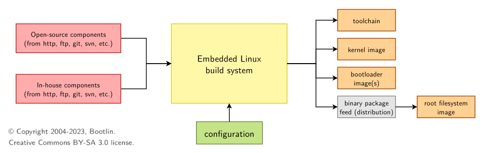
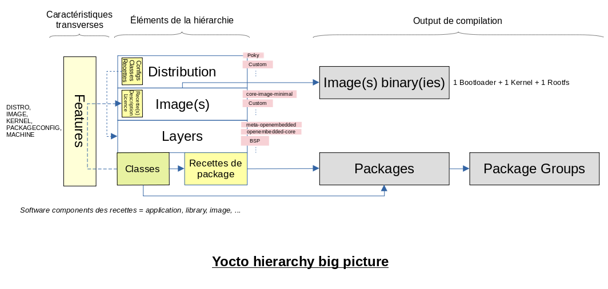
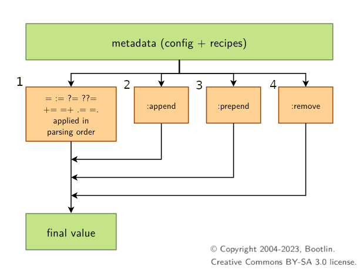
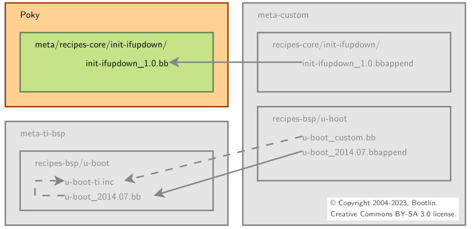
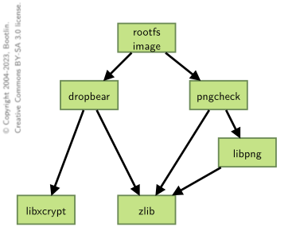
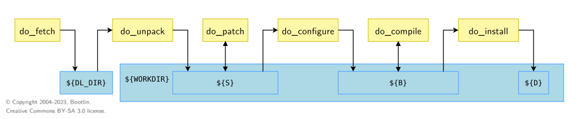
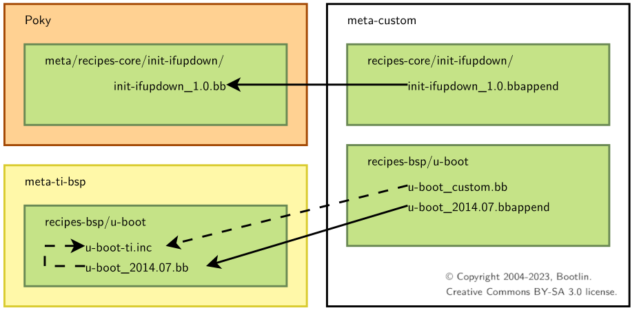
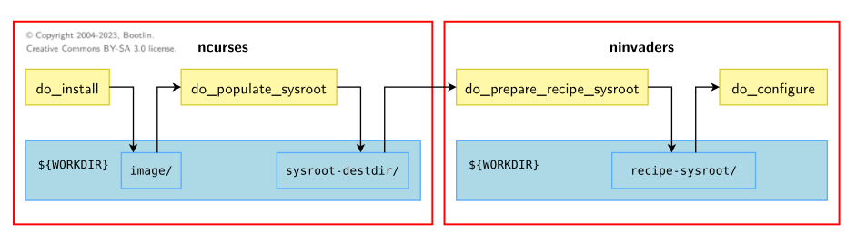

# Synthèse des formations  YOCTO i) par Ch. Blaess (janvier 2020), ii) par Bootlin en 2022

<!-- Introduction de code HTML pour gérer les LINE BREAKS -->
<dl>
  </br>
</dl>

## Sommaire
[1 - Principe, vocabulaire, hiérarchie, liens](#1---principe-vocabulaire-hiérarchie-liens)
[2 - Les basiques avec la distribution de référence (Poky)](#2---les-basiques-avec-la-distribution-de-référence-poky)
&emsp;[2.1 - From scratch](#21---from-scratch)
&emsp;&emsp;[2.1.1 - Environnement](#211---environnement)
&emsp;&emsp;[2.1.2 - Compilation et configurations par défault](#212---compilation-et-configurations-par-défault)
&emsp;&emsp;[2.1.3 - Configuration du build](#213---configuration-du-build)
&emsp;[2.2 Recettes et applications : .bb et IMAGE_INSTALL_append](#22-recettes-et-applications--recettebb-et-image_install_append)
&emsp;&emsp;[2.2.1 - Jouer avec les recettes](#221---jouer-avec-les-recettes)
&emsp;&emsp;[2.2.2 - Ajout de packages hors Poky](#222---ajout-de-packages-hors-poky)
&emsp;[2.3 - Poky : Layers & more](#23---poky--layers--more)
&emsp;&emsp;[2.3.1 Common layers](#231-common-layers)
&emsp;&emsp;[2.3.2 Third party layer](#232-third-party-layer)
&emsp;&emsp;[2.3.3 Outils, documentation, licence](#233-outils-documentation-licence)
&emsp;[2.4 - Image](#24---image)
&emsp;&emsp;[2.4.1 - Fonctionnalités de l'image .bbclass et IMAGE_FEATURES](#241---fonctionnalités-de-limage-fonctionnalitésbbclass--image_features)
&emsp;&emsp;[2.4.2 Création d'une image](#242-création-dune-image)
&emsp;&emsp;[2.4.3 - Personnalisation des recettes](#243---personnalisation-des-recettes)
[3 - Au coeur de Yocto](#3-au-coeur-de-yocto)
&emsp;[3.1 Les projets Yocto](#31-les-projets-yocto)
&emsp;&emsp;[3.1.1 Environnement, configuration, build image](#311-environnement-configuration-build-image)
&emsp;[3.2 Les Variables](#32-les-variables-p63)
&emsp;[3.3 Les recettes](#33-les-recettes)
&emsp;&emsp;[3.3.1 Ecrire des recettes (p86)](#331-ecrire-des-recettes-p86)
&emsp;&emsp;[3.3.2 Utilisation avancée (p123)](#332-utilisation-avancée-p123)
&emsp;&emsp;[3.3.3 Aller plus loin avec les recettes (p223)](#333-aller-plus-loin-avec-les-recettes-p223)
&emsp;&emsp;&emsp;&emsp;[3.3.2.1 Extension de recettes et recettes personnalisées](#3321-extension-de-recettes-et-recettes-personnalisées)
&emsp;&emsp;&emsp;&emsp;[3.3.2.2 Les classes](#3322-les-classes)
&emsp;&emsp;&emsp;&emsp;[3.3.2.3 Inclure des fichiers](#3323-inclure-des-fichiers)
&emsp;[3.4 Layers](#34-layers)
&emsp;&emsp;[3.4.1 Les Fondamentaux](#341-les-fondamentaux)
&emsp;&emsp;[3.4.2 BSP layers](#342-bsp-layers)
&emsp;&emsp;&emsp;&emsp;[3.4.2.1 Configuration hardware](#3421-configuration-hardware)
&emsp;&emsp;&emsp;&emsp;[3.4.2.2 Bootloader](#3422-bootloader)
&emsp;&emsp;&emsp;&emsp;[3.4.2.3 Kernel](#3423-kernel)
&emsp;[3.5 Images](#35-images)
&emsp;&emsp;[3.5.1 Basiques](#351-basiques)
&emsp;&emsp;[3.5.2 Génération du Rootfs](#352-génération-du-rootfs)
&emsp;&emsp;[3.5.3 Image types](#353-image-types)
&emsp;&emsp;[3.5.4 Package group](#354-package-group)
&emsp;[3.6 Outils](#36-outils)
&emsp;&emsp;[3.6.1 Debug de packages](#361-debug-de-packages--debugging-yocto)
&emsp;&emsp;[3.6.2 Recipetools](#362-recipetool)
&emsp;&emsp;[3.6.3 Les logs](#363-les-logs)
&emsp;&emsp;[3.6.4 Inspection de packages](#364-inspection-de-packages-après-un-1er-build-réussi)
&emsp;&emsp;[3.6.5 Devtool](#365-devtool)
&emsp;[3.7 SDK](#37-sdk)
&emsp;[3.8 Kas](#38-kas)
&emsp;[3.x Les licences](#3x-les-licences)

</br>

## 1 - Principe, vocabulaire, hiérarchie, liens

**<u>Principe de Yocto</u>**



**<u>Ma vision de la hiérarchie Yocto</u> (WIP)**


Faire de beaux diagrammes avec [Mermaid diagrams](https://mermaid.js.org/intro/)

**<u>Vocabulaire</u>**

| Description | Fonction |
|:-------------:|:--------:|
| _Image binaire_ | 1 bootloader + 1 kernel + 1 rootfs |
| [_Bitbake_](https://docs.yoctoproject.org/bitbake.html) | Moteur de compilation (task scheduler et exécution) lisant et interprétant des fichiers de recettes (recipes) pour construire les différents éléments du système embarqué. Les termes “BitBake” et “build system” sont parfois utilisés pour évoquer OpenEmbedded Build System. |
| _Recette (recipe)_ | Fichier ```.bb``` contenant les méthodes et les éléments de configuration nécessaires à la production d'un _**package**_. |
| [_Tâches (tasks)_](https://docs.yoctoproject.org/ref-manual/tasks.html) | Tasks are units of execution for _**bitbake**_. Recipes (.bb files) use tasks to complete fetching, configuring, compiling, and packaging software. A task provides a set of actions to perform. Tasks have dependencies over other tasks (including tasks of other receipes). |
| _Surcharge_ (override) | Méthode consistant à introduire un nouveau fichier de recette ```.bbappend``` afin de changer l'interprétation par Bitbake de la recette initiale correspondante. |
| _Metadata_ | Ce sont les données d'entrées de **bitbake**. Elles sont composées de **fichiers de configuration**, de **recettes**, de **classes**, de **fichiers _includes_**. Les metadata sont organisées en _layers_. |
| _Layer_ | Répertoire muni d’un préfixe particulier ```meta-``` contenant une collection de fichiers de configuration, de recettes et de classes destinés à un sujet/objectif unique. ```openembedded-core``` est le _**core layer**_ (layers {```meta``` + ```meta-skeleton```} + ```scripts```). |
| [_Recette d'image_](https://docs.yoctoproject.org/ref-manual/images.html) | Précise l'ensemble des recettes à compiler pour créer une image. |
| _Distribution_ | La liste des images proposées, des layers disponibles, des recettes sélectionnées et de leur configuration par défaut. |
| [_Classe_](https://docs.yoctoproject.org/ref-manual/classes.html) | Il s'agit d'une transposition des notions d'encapsulation et d'héritage rapporter à la compilation. Provide an abstraction to common code, which can be re-used in multiple recipes. Common tasks do not have to be re-developed : i) Any metadata and task which can be put in a recipe can be used in a class, ii) Classes extension is .bbclass, iii) Classes are located in the classes folder of a layer. |
| [_Feature_](https://docs.yoctoproject.org/ref-manual/features.html) | Fonctionnalités de haut-niveau que l’on peut sélectionner sans se soucier du détail du package correspondant. Les catégories de ```Features``` sont MACHINE, KERNEL, IMAGE, DISTRO, PACKAGECONFIG. |
| _Poky_ | i) dépôt _Git_ rassemblant les dépôts _Git_ de bitbake, openembedded-core, yocto-docs et meta-yocto,  ii) distribution de référence proposée par Yocto (layer ```meta-poky```). |

</br>
</br>

**<u>Liens</u>**

| Nom | Liens |
|:-----------:|:-----------------------------:|
| Overview manual | https://docs.yoctoproject.org/dev/overview-manual/index.html |
| Dépôt Yocto | https://git.yoctoproject.org/ |
| Liste des versions | https://wiki.yoctoproject.org/wiki/Releases |
| Liste des layers maintenus | https://layers.openembedded.org/layerindex/branch/master/layers/ |

</br>

## 2 - Les basiques avec la distribution de référence (Poky)

### 2.1 - From scratch

```$ git  clone  git://git.yoctoproject.org/poky  -b <version>```

#### 2.1.1 - Environnement

Set up environnement, build, répertoires, exemple avec QEMU :

```$ source poky/oe-init-build-env <build-directory>```
*Ex : build-directory = build-qemu*

Sourcer ce script à les impacts suivants :

+ **Variables d'environnement**

| Nom | Description |
|:-------------:|:-------------:|
| BUILDDIR | Chemin absolue vers le répertoire de build |
| PATH | Ensemble des répertoires des executables. ```scripts/``` et ```bitbake/bin/``` sont ajoutés au début (prepended) |

+ **Commandes disponibles**

| Nom | Description |
|:-------------:|:-------------:|
| bitbake | Exécute les tâches des recettes (download, configure, compile, ...)  |
| bitbake-* | Toutes commandes  du moteur de compilation |

+ **Création/set up des répertoires  ```<build-directory>``` et ```<build-directory>/conf/```**

Set up seulement si le _source_ du script a déjà été effectué 1 fois : les répertoires et fichiers de build sont déjà créés (CQFD).

```
$ pwd
$YOCTOLAB_ROOT/build-quemu
$ ls conf/
bblayers.conf  local.conf  templateconf.cfgx
```

| Nom | Description |
|:-------------:|:-------------:|
| bblayers.conf | Liste explicite des layers |
| local.conf | Variables de configuration pour la compilation relatives à l'utilisateur : surcharge ou initialisation  |

+ **Ressources visées et/ou disponibles**

| Nom | Description |
|:-------------:|:-------------:|
| core-image-minimal | Image minimale pour booter sur cible et avoir accès aux commandes et services de base  |
| core-image-sato | Image contenant Sato, interface utilisateur _Gnome mobile-based_ |
| meta-toolchain | Génère la toolchain croisée installable |
| meta-ide-support | Génère la toolchain croisée avec des outils (gdb, qemu, ...) pour l'intégration dans un IDE |

</br>

#### 2.1.2 - Compilation et configurations par défault

```
$ bitbake  core-image-minimal
$ ls
bitbake-cookerdaemon.log  cache/  conf/  downloads/  sstate-cache/  tmp/
```

Extrait de https://docs.yoctoproject.org/dev/overview-manual/yp-intro.html#some-basic-terms :

> _BitBake is a task scheduler and execution engine that parses instructions (i.e. recipes) and configuration data. After a parsing phase, BitBake creates a dependency tree to order the compilation, schedules the compilation of the included code, and finally executes the building of the specified custom Linux image (distribution). BitBake is similar to the make tool._

> _During a build process, the build system tracks dependencies and performs a native or cross-compilation of each package. As a first step in a cross-build setup, the framework attempts to create a cross-compiler toolchain (i.e. Extensible SDK) suited for the target platform._

Compiler à les impacts suivants :

+ **Répertoire de build**

| Nom | Description |
|:-------------:|:-------------:|
| ```conf/``` | Fichiers de configuration spécifiques à l'image et aux layers (existe depuis le ```$ source poky/oe-init-build-env``` ) |
| ```downloads/``` | Tarballs des recettes nécessaire à la compilation téléchargés depuis l'upstream  |
| ```sstate-cache/``` | Shared-state cache, stocke les sorties de chacune des tâches bitbake, utile pour accélérer la compilation |
| ```tmp/``` | Toutes les output du build system |

+ **Contenu de ```tmp/```**

```
$ ls tmp/deploy/
images/  licenses/  rpm/
```

| Nom | Description |
|:-------------:|:-------------:|
| ```tmp/work/``` | Used to unpack, configure and build packages. Contient les sources patchés, les objets générés et les logs. |
| ```tmp/sysroots-*/``` | Librairies dynamiques et fichiers en-têtes utilisés pour la compilation d'applications (cible et host), voir § [3.3.3 Aller plus loin avec les recettes (p223)](#333-aller-plus-loin-avec-les-recettes-p223)|
| ```tmp/deploy/``` | Répertoire final de build |
| ```tmp/deploy/images/``` | Contient les images complètes compilées par le build system  |
| ```tmp/buildstats/``` | Statistiques de compilation pour tous les packages compilés (CPU usage, temps passé, host, timestamps, ...) |

</br>

#### 2.1.3 - Configuration du build

| Nom | Description |
|:-------------:|:-------------:|
| BB_NUMBER_THREADS | Nombre de tâche bitbake à effectuer en parallèle |
| PARALLEL_MAKE | Nombre de job en parallèle à la compilation |
| MACHINE | ex.: beaglebone |

</br>

### 2.2 Recettes et applications : ```<recette>.bb``` et ```IMAGE_INSTALL_append```

#### 2.2.1 - Jouer avec les recettes

Liste des recettes de Poky :
``` $ ls  poky/meta/recipes* ```

Nombre de recette de Poky :
``` $ find poky/meta/recipes* "*bb"| wc -l ```

Ajout d'une application de Poky (```$BUILD_ROOT/conf/local.conf```)

```IMAGE_INSTALL_append = " mc"```

Verification de la version d'un package présente dans Poky
``` $ bitbake -s | grep ^mc ```

</br>

#### 2.2.2 - Ajout de packages hors Poky

Ajout de l'éditeur de texte ```nano``` :

+ *<https://layers.openembedded.org>   chercher dans 'Receipes' le nom 'nano'*
+ *Il appartient au Layer 'meta-oe' appartenant à la collection de layers meta-openembedded*

```
git clone git://git.openembedded.org/meta-openembedded -b gategarth
bitbake-layers add-layer ../meta-openembedded/meta-oe/
```

Ajout dans l'image ```nano``` de ```meta-oe``` (```$BUILD_ROOT/conf/local.conf```)
```IMAGE_INSTALL_append = " nano"```

</br>

### 2.3 - Poky : Layers & more

**TOUS** les layers sont des collections de métadonnées telles les recettes, les configurations, les classes, les fichiers includes et sont des répertoires.

#### 2.3.1 Common layers

| Nom | Description |
|:-------------:|:-------------:|
| ```meta/``` | Contains the OpenEmbedded-Core metadata |
| ```meta-skeleton/``` | Contains template recipes for BSP and kernel development |
| ```meta-poky/``` | Holds the configuration for the Poky reference distribution |
| ```meta-yocto-bsp/``` | Configuration for the Yocto Project reference hardware board support package |

#### 2.3.2 Third party layer

Tout ce qui n'est pas spécifique et nécessaire à Poky comme :

+ le BSP spécifique à 1 board et bien évidement, il n'y en a 1 seul à la fois. A titre d'exemples :

  + ```meta-ti-bsp/```
  + ```meta-raspberrypi/```

+ les interfaces graphiques telle Qt ```meta-qt5/```
+ etc

#### 2.3.3 Outils, documentation, licence

Poky arrive avec des outils et des scripts permettant la compilation

| Nom | Description |
|:-------------:|:-------------:|
| ```bitbake/``` | |
| ```documentation/``` | All documentation sources for the Yocto Project documentation. Can be used to generate nice PDFs |
| ```LICENSE``` | The license under which Poky is distributed (a mix of GPLv2 and MIT) |
| oe-init-build-env | Script to set up the OpenEmbedded build environment. It will create the build directory |
| ```scripts/``` | Contains scripts used to set up the environment, development tools, and tools to flash the generated images on the target.|

> ATTENTION : Ce ne sont pas de layers de Yocto !!!

</br>

### 2.4 - Image

#### 2.4.1 - Fonctionnalités de l'image ```<fonctionnalités>.bbclass``` &  ```IMAGE_FEATURES```

Les fonctionnalités proposées par la classe ***core-image*** est implémentée dans le fichier ```poky/meta/classes/core-image.bbclass``` :
                    *x11, x11-base, x11-sato, tools-debug, eclipse-debug, tools-profile, tools-testapps, tools-sdk, [...]*

Fichier de description du build ```poky/meta/recipes-core/images/core-image-base.bb``` incluant les fonctionnalités

+ _**inherit core-image**_            : la recette hérite d’une classe prédéfinie qui décrit le contenu d’une image en proposant des fonctionnalités optionnelles.
+ _**IMAGE_FEATURES += "splash"**_    : ajoute la fonctionnalité splashscreen*

Build de l'image utilisée initialement: poky ou custom.

#### 2.4.2 Création d'une image

*1. Create layer et add layer avec Bitbake
2. Creation du fichier de description du build ```$YOCTOLAB/meta-my-layer/recipes-custom/images/my-image.bb```
3. Ajout des fonctionnalités (```IMAGE_FEATURES```) et des applications (```IMAGE_INSTALL:append```), peuvent être initialement dans ```$BUILD_ROOT/conf/local.conf```
4. Build avec le nom ```my-image```*

#### 2.4.3 - Personnalisation des recettes

Voir § [3.3 Les recettes](#3321-extension-de-recettes-et-recettes-personnalisées)

</br>

## 3. Au coeur de Yocto

</br>

| Nom | Liens |
|:-------------:|:-------------:|
| Wiki | https://wiki.yoctoproject.org/wiki/Main_Page |
| Documentation | https://docs.yoctoproject.org/ |
| Doc. Yocto | https://docs.yoctoproject.org/ |
| Layers | https://layers.openembedded.org/ |
| Advanced Metadata | https://docs.yoctoproject.org/kernel-dev/advanced.html#working-with-advanced-metadata-yocto-kernel-cache |
| Variables d'environnement & tâches bitbake, description brève | $YOCTOLAB_ROOT/openembedded-core/meta/conf/documentation.conf |
| Bitbake | https://docs.yoctoproject.org/bitbake.html |

### 3.1 Les projets Yocto

#### 3.1.1 Environnement, configuration, build image

Evironnement : voir § [2.1.1 - Environnement](#211---environnement)
Build & Configuration : voir § [2.1.2 - Compilation et configurations par défault](#212---compilation-et-configurations-par-défault)
Configuration & Build : voir § [2.1.3 - Configuration du build](#213---configuration-du-build)

### 3.2 Les Variables  (p63)

Variables de configuration : en majuscules (ex : CONF_VERSION), valeur en string

**<u>Portées des variables</u>**

+ Définie dans 1 fichier de configuration (.conf) => Portée globale
+ Définie dans 1 recette (.bb, .bbappend, .bbclass) => Portée locale


**<u>Opérateurs</u>**

| Opérateur | Description |
|:-------------:|:-------------:|
| = | assigne la valeur |
| := | assigne immédiatement la valeur |
| += | append avec espace |
| =+ | prepend avec espace|
| .= | append sans espace |
| =. | prepend sans espace|
| ? | assigne la valeur si pas de valeur au préalable |
| ?? | idem mais avec 1 plus faible précédence |

> Exemple :
>
> + ```VAR ?= "a"``` puis ```VAR += "b"``` => résultat : ```VAR = "a b"```
> + ```VAR += "b"``` puis ```VAR ?= "a"``` => résultat : ```VAR = "b"```
>
> i) L'ordre de parsing des fichiers est difficile à prédire...
> ii) Pour éviter les problèmes, préférer l'override dans ```$BUILDDIR/conf/local.conf``` aux opérateurs _append_ et _prepend_.

**<u>Override (surcharge)</u>**

Format : ```<VARIABLE>:<override> = "some_value"```
Ancienne synthaxe : ```<VARIABLE>_<override> = "some_value"``` (Ko sur Kirkstone)

> Les différents cas :

> 1) Modifier la valeur d'une variable
>
> + append (sans espace): _```IMAGE_INSTALL:append = " dropbear"```_   (ajouter l'espace avec la valeur)
> + prepend (sans espace): _```FILESEXTRAPATHS:prepend := "${THISDIR}/${PN}:"```_
> + remove (toutes les occurences): _```IMAGE_INSTALL:remove = "i2c-tools"```_

> 2) Affectation conditionnelle avec indication de la surcharge dans la variable _OVERRIDES_
>
> ```OVERRIDES="arm:armv7a:ti-soc:ti33x:beaglebone:poky"```
>
> ```KERNEL_DEVICETREE:beaglebone = "am335x-bone.dtb" # This is applied (overriden)```
> ```KERNEL_DEVICETREE:dra7xx-evm = "dra7-evm.dtb" # This is ignored (not overriden)```

> 3) Affectation conditionnelle avec précédence
>
> Si on définit :
> ```
> IMAGE_INSTALL:beaglebone = "busybox mtd-utils i2c-tools"
> IMAGE_INSTALL = "busybox mtd-utils"
> ```
>
> Valeur après parsing :
>  ```IMAGE_INSTALL = "busybox mtd-utils i2c-tools"   # If the machine is beaglebone```
> OU
> ```IMAGE_INSTALL = "busybox mtd-utils" # Otherwise```

> 4) Combinaisons de surcharges
>
> Si on définit :
> ```
> IMAGE_INSTALL = "busybox mtd-utils"
> IMAGE_INSTALL:append = " dropbear"
> IMAGE_INSTALL:append:beaglebone = " i2c-tools"
> ```
>
> Valeur après parsing :
> ```IMAGE_INSTALL = "busybox mtd-utils dropbear i2c-tools" if the machine being built is beaglebone.```
> OU
> ```IMAGE_INSTALL = "busybox mtd-utils dropbear" otherwise.```

**<u>Ordre d'affectation des variables</u>**



<u>**Packages variants**</u>

Certains packages ont le même but et ne peuvent être utilisés qu'un seul à la fois : ce sont des **virtual packages**.
Un **virtual package** est une fonctionnalité ou un ensemble de fonctionnalités identiques fournies par plusieurs packages. Seulement 1 seul de ces packages sera compilé et intégré à l'image.

Exemples :

|  Virtual Package | Packages avalaible |
|:-------------:|:-------------:|
| virtual/bootloader | u-boot, u-boot-ti-staging… |
| virtual/kernel | linux-yocto, linux-yocto-tiny, linux-yocto-rt, linux-ti-staging… |
| virtual/libc | glibc, musl, newlib |
| virtual/xserver | xserver-xorg |

Le _virtual name_ est fournis par la variable ```PROVIDES```. Ex : ```PROVIDES = "virtual/kernel"```

La variable de configuration associée pour sélectionner 1 package dans un virtual package est _**```PREFERRED_PROVIDER_<variant-name >```**_.
Ex :
> ```
> PREFERRED_PROVIDER_virtual/kernel ?= "linux-ti-staging"
> PREFERRED_PROVIDER_virtual/libgl = "mesa"
> ```

Version :
> ```
> DEFAULT_PREFERENCE = "-1"     # Version défaut du(es) package(s)
> PREFERRED_VERSION_linux -yocto = "5.14%" # Récupération d'une version spécifique d'un package (en le nommant!)
> ```

<u>**Les Packages**</u>

Ils sont contrôlés par la variable de conf. _**```IMAGE_INSTALL```**_ et filtrés par _**```PACKAGE_EXCLUDE```**_.

###  3.3 Les recettes

1 recette décrit un software component (1 programme, 1 librarie ou une image)

**Où trouver les recettes?**

Liste des recettes d'un layer
```$ ls  <layer-name>/recipes*```

Noms des recettes
```$ find <layer-name>/recipes* -name '*bb' -o -name '*bbappend'```

Nombre de recettes d'un layer
```$ find <layer-name>/recipes* -name '*bb' -o -name '*bbappend' | wc -l```

Recette d'image - Ex :
```$ ../meta-tutorial-layer/recipes-custom/images/tutorial.bb```

#### 3.3.1 Ecrire des recettes (p86)



<u>**Organisation**</u>

+ ```<application>.inc``` : meta-données agnostiques à la version.
+ ```<application>_<version>.bb``` : meta-données spécifiques à une version et nécessitant d'inclure ```<application>.inc```.
+ ```<application>_<version>.bbappend``` (voir § [utilisation avancée](#332-utilisation-avancée-p123)): extension de recette permettant de surcharger la recette originelle c'est à dire de personnaliser la recette sans apporter de modification à son fichier.

Les recettes sont composées de 3 parties :

+ le header (le quoi?/ le qui?)
+ les sources (le où?)
+ les tâches bitbake (le comment?)

</br>

<u>**Variables de base**</u>

+ Packages

|  Nom | Description |
|:-------------:|:-------------:|
| ```PN``` | package name, as specified in the recipe file name |
| ```BPN``` | ```PN``` with prefixes and suffixes removed such as ```nativesdk-```, or ```-native``` |
| ```PV``` | package version, as specified in the recipe file name |
| ```BP``` | defined as ```${BPN}-${PV}``` |

+ Recipe headers

|  Nom | Description |
|:-------------:|:-------------:|
| ```DESCRIPTION``` | describes what the software is about |
| ```HOMEPAGE``` | URL to the project’s homepage |
| ```PRIORITY``` | defaults to optional |
| ```SECTION``` | package category (e.g. console/utils) |
| ```LICENSE``` | the application’s license, using SPDX identifiers (https://spdx.org/licenses/) |

+ Recipe sources

|  Nom | Description |
|:-------------:|:-------------:|
| ```SRC_URI``` | Set of URI schemes pointing to the resource locations (local or remote) defining where and how to retrieve the needed elements. |
| ```SOURCEFORGE_MIRROR```, ```GNU_MIRROR```, ```KERNELORG_MIRROR``` | Variables pour les miroirs |
| ```FILESPATH``` | Variables pour le chemin de recherche utilisé également par bitbake pour le schéma ```file://...```, combinaison de _**Base paths**_ et de ```FILESOVERRIDES``` |
| ```FILESOVERRIDES``` | ```${TRANSLATED_TARGET_ARCH}:${MACHINEOVERRIDES}:${DISTROOVERRIDES}``` |
| ```FILE_DIRNAME``` | directory containing the .bb file |
| ```LIC_FILES_CHKSUM``` | URI pointing to the license file in the source code as well as its checksum |

```SRC_URI``` utilise les schémas :
+ git : ```git://<url>;protocol=<protocol>;branch=<branch>```
+ http, https et ftp : ```${SOURCEFORGE_MIRROR}/<project-name>/${BPN}-${PV}.tar.gz```
+ fichier : ```file://...```

Ex ```SRC_URI```:
> ```
> SRC_URI = "http://example.com/src.tar.bz2;name=tarball \
> http://example.com/fixes.patch;name=patch"
> SRC_URI[tarball.md5sum] = "97b2c3fb082241ab5c56..."
> SRC_URI[patch.md5sum] = "b184acf9eb39df794ffd..."
> ```

Valeurs classiques de _**Base paths**_ dans ```FILESPATH```:
> ```${FILE_DIRNAME}/${BP}``` (e.g. BP = dropbear-2020.81)
> ```${FILE_DIRNAME}/${BPN}``` (e.g. BPN = dropbear)
> ```${FILE_DIRNAME}/files```
> Items in ```FILESEXTRAPATHS``` (none by default)

Exemple de valeurs de ```FILESOVERRIDES```:
> ```arm:armv7a:ti-soc:ti33x:beaglebone:poky     # Applied left to right```

+ Recipe tasks

Voir plus bas...
</br>

<u>**Dépendances des recettes**</u>


|  Nom | Description |
|:-------------:|:-------------:|
| ```DEPENDS``` | List of the recipe build-time dependencies |
| ```RDEPENDS``` | List of the package runtime dependencies. Must be package specific (e.g. with :```${PN}```) |

Exemples :
> ```DEPENDS = "recipe-b"```: the local ```do_prepare_recipe_sysroot``` task depends on the ```do_populate_sysroot``` task of ```recipe-b```.
> ```RDEPENDS:${PN} = "package-b"```: the local ```do_build``` task depends on the ```do_package_write_<archive-format>``` task of ```recipe-b```.

> ```DEPENDS = "recipe-b (>= 1.2)"``` : dépendance selon la version
> ```RDEPENDS:${PN} = "recipe-b (>= 1.2)"``` : dépendance selon la version

Voir paragraphe [Les dépendances en détail](#les-dépendances-en-détail).

</br>
</br>

<u>**Recipe tasks workflow**</u>


|  Nom | Description |
|:-------------:|:-------------:|
| ```DL_DIR``` | Download directory |
| ```WORKDIR``` | The recipe’s working directory |
| ```S``` | The directory where the source code is locally extracted |
| ```B``` | The directory where bitbake places the objects generated during the build |
| ```D``` | The destination directory (root directory of where the files are installed, before creating the image). |

+ Créer une nouvelle tâche avec ```addtask```

```
do_mkimage () {
uboot-mkimage ...
}
addtask do_mkimage after do_compile before do_install
```

</br>

<u>**Patchs**</u>

Appliqués pour :

+ supporter de vieilles versions (bug, securité)
+ résoudre des problèmes de cross-compilation
+ ajouter/modifier du code avant une validation pour l'upstream

Les patchs sont appliqués par la tâche ```do_patch```

|  Nom | Description |
|:-------------:|:-------------:|
| ```SRC_URI``` | Liste des fichiers à appliquer au patch |
| ```PATCHTOOL``` | Outil utilisé pour appliquer le patch |
| ```PATCHRESOLVE``` | Que faire en cas de conflit (```noop``` (meta-poky) ou ```user```) |

Exemple :
> ```
> SRC_URI += "file://joystick-support.patch \
> file://smp-fixes.diff \
> "
>```

Valeur par défaut pour Poky (```poky/meta-conf/bitbake.conf```):
> ```PATCHTOOL = 'quilt'```

</br>

#### 3.3.2 Utilisation avancée (p123)

#####  3.3.2.1 Extension de recettes et recettes personnalisées



+ Dans ```meta-custom```, le layer personnalisé, toutes les recettes (```.bb``` & ```.bbappend```) s'appliquent à une version spécifique.
+ reprendre l'aborescence de répertoire des recettes et software components : ```recipes-<name>/<recipe-name>/```
+ Les extensions de recettes s'appliquent seulement aux recettes existantes et non personnalisées. Elles :
  + peuvent directement inclurent le(s) fichier(s) de méta-données générique aux versions (```.inc```)
  + respectent la synthaxe de la recette originelle :```<software-component-name>_<version>```, la wildward ```%``` est utilisable. Ex. :
  ```example_0.%.bbappend``` applies to ```example_0.1.bb``` and ```example_0.2.bb```
+ Si un nouveau fichier est ajouté, son chemin en prepend doit-être ajouté à ```FILESEXTRAPATHS``` et son nom dans ```SRC_URI```. Ex :

> ```
> FILESEXTRAPATHS:prepend := "${THISDIR}/files:"
> SRC_URI += "file://custom-modification-0.patch \
> file://custom-modification-1.patch \
> "
> ```

+ Modifier une tâche existante avec ```:prepend``` ou ```:append```

> ```
> do_install:append() {
> install -d ${D}${sysconfdir}
> install -m 0644 hello.conf ${D}${sysconfdir}
> }
> ```

#####  3.3.2.2 Les classes

Principe de l'encapsulation de la POO rapportée à Yocto. C'est une abstraction pour le code dont les modifications sont inutiles ou inappropriées (Ex : cmake, kernel, meson, systemd, ...). Les classes peuvent être ré-utilisées dans des recettes.

Localisation => réportoires ```classes/``` comme ```meta/classes/```
Extension => ```.bbclass```

Classe classiques : base class, kernel class, autotools class, useradd class, bin_package class.

Chaque classe a son propre mode d'utilisation avec des variables spécifiques. Exemple d'utilisation de ```useradd``` :

> ```
> DESCRIPTION = "useradd class usage example"
> PRIORITY = "optional"
> SECTION = "examples"
> LICENSE = "MIT"
>
> SRC_URI = "file://file0"
> LIC_FILES_CHKSUM = "file://${COREBASE}/meta/files/common-licenses/MIT;md5=0835ade698e0bc..."
>
> inherit useradd
>
> USERADD_PACKAGES = "${PN}"
> USERADD_PARAM = "-u 1000 -d /home/user0 -s /bin/bash user0"
>
> do_install() {
>      install -m 644 file0 ${D}/home/user0/
>      chown user0:user0 ${D}/home/user0/file0
> }
> ```

</br>

#####  3.3.2.3 Inclure des fichiers

|  Nom | Description |
|:-------------:|:-------------:|
| ```inherit``` | Pour hériter des fonctionnalités d'une classe, utilisable dans des recettes ou des classes elles-mêmes. |
| ```include``` | Utilisable par tous les fichiers! Utilise ```BBPATH``` pour trouver le chemin relatif. |
| ```require``` | Idem mais renvoie une _parsing error_ si le fichier à inclure n'est pas trouvé. |

</br>

#### 3.3.3 Aller plus loin avec les recettes (p223)

##### **<u>Per-recipe sysroot</u>**

Sysroot est le répertoire logique racine où ```Gcc``` va chercher les headers et ```ld``` les librairies pour chacune des recettes. Il contient :

+ les headers du kernel
+ les headers et librairies du user space 

_Avant le build_, **chaque recette** <u>prépare</u> son propre _sysroot_ (tâche ```do_prepare_recipe_sysroot```):

+ avec les headers et librairies dont la recette dépend (variable ```DEPENDS```)
+ en assurant que la phase de configuration ne détecte aucune librairie non-explicitement listée dans la variable ```DEPENDS``` mais pour autant compilée au préalable.
+ ```${WORKDIR}/recipe-sysroot``` pour les recettes cibles
+ ```${WORKDIR}/recipe-sysroot-native``` pour les recettes natives

_A la fin du build_, **chaque recette** <u>produit</u> son _sysroot_ destination (tâche ```do_populate_sysroot```):

+ son propre morceau de _sysroot_  contenant ses headers et libraires
+ ce sont les entrées pour les autres recettes leur permettant de générer leur_recipe-sysroot_
+ ```${WORKDIR}/sysroot-destdir```

Exemple avec _**ncurses**_, librairie sur étagère, et _**ninvaders**_, librairie développée dépendant de _**ncurses**_ :


Voir aussi [Les dépendances en détail](#les-dépendances-en-détail).
</br>

##### **<u>Les dépendances en détail</u>**

&nbsp;&nbsp;&nbsp;&nbsp;&nbsp;&nbsp;- _Les dépendances de build_ : ```DEPENDS```

<u>Cas typique :</u> un programme a besoin d'une librairie et de ses headers pour être configuré ou/et compilé. Bref, la librairie doit construire sont sysroot _d'avant build_.

Exemple : voir [Sysroots](#per-recipe-sysroot)

&nbsp;&nbsp;&nbsp;&nbsp;&nbsp;&nbsp;- _Les dépendances de run-time_ : ```RDEPENDS```

<u>Cas typique :</u> un programme en utilise un autre au run-time (sockets, DBUS, ...) ou bien il l'exécute. Par contre, il n'en a pas besoin au moment du build.

&nbsp;&nbsp;&nbsp;&nbsp;&nbsp;&nbsp;- _Autres dépendances de build_ : ```RRECOMMENDS```

Si un package ayant de dépendance n'est pas buildé, il sera ignoré pour éviter de planter le build.
<u>Cas typiques :</u>

+ A package extends the features of a program, but its build has been disabled
explicitly (e.g. via BAD_RECOMMENDATIONS)
+ Depending on a kernel module that might also be built-in in the kernel Image

Exemple :

> In watchdog_5.16.bb, the line
> ```RRECOMMENDS:${PN} += "kernel-module-softdog"```
> does nothing if the softdog kernel module is not built by the kernel (could be builtin)

##### **<u>Les flags des variables</u>**

Les Variables flags ou varflags sont utilisés pour sauvegarder des informations supplémentaires sur les variables ou les tâches. Elles servent entre autres à controler certaines fonctionnalités des tâches.
Ex : ```SRC_URI[md5sum] = "97b2c3fb082241ab5c56ab728522622b"```

| Variable flag | Description |
|:-------------:|:-------------:|
| dirs | répertoire à créer avant son lancement. |
| noexec | annule l'exécution de la tâche |
| nostamp | ne pas créer de fichier de _stamp_ quand la tâche est lancée |
| doc | documentation de la tâche affichée dans _listtasks_. |
| depends | Ajouter une dépendance entre 2 tâches spécifiques |
etc...

[Liste des varflags](https://docs.yoctoproject.org/bitbake/2.2/bitbake-user-manual/bitbake-user-manual-metadata.html#variable-flags) supportés par bitbake.

##### **<u>Les packages features</u>**

Les _features_ peuvent être compilées selon les besoins afin d'éviter de compiler tout un _software-component_ entier. La variable ```PACKAGECONFIG``` est utilisée à cet effet avec une granularité à la _feature_ pour les packages.

```PACKAGECONFIG``` contient la liste des _features_ à activer.
```PACKAGECONFIG[feature]``` contient 6 arguments séparé 1 virgule :

+ ```EXTRA_OECONF``` : utilisé par la tâche de config si la _feature_ est active.
+ ```EXTRA_OECONF``` : ajouté si la _feature_ est désactivée
+ ```DEPENDS``` : dépendance de build supplémentaire (si activé)
+ ```RDEPENDS``` : dépendance de run-time supplémentaire (si activé)
+ ```RRECOMMENDS``` : recommendation de run-time supplémentaire x(si activé) 
+ Toutes les configurations de gestion de conflits de ```PACKAGECONFIG``` pour la _feature_

=> Tout ce qui 'est pas utilisé est laissé blanc ou omis.

Exemple tiré de _ConnMan_ (```openembedded-core/meta/recipes-connectivity/connman/connman.inc```)

> ```
> PACKAGECONFIG ??= "wifi openvpn"
>
> PACKAGECONFIG[wifi] = "--enable-wifi,             \
>                        --disable-wifi,            \
>                        wpa-supplicant,            \
>                        wpa-supplicant"
> PACKAGECONFIG[bluez] = "--enable-bluetooth,       \
>                         --disable-bluetooth,      \
>                         bluez5,                   \
>                         bluez5"                   \
> PACKAGECONFIG[openvpn] = "--enable-openvpn,       \
>                           --disable-openvpn,      \
>                           ,                       \
>                           openvpn"                \
>```

<u>Activation d'une feature de package config</u>
Dans une extension de recette : ```PACKAGECONFIG:append = " <feature>"```
Ex. : ```PACKAGECONFIG:append = " tui"```

Dans un fichier de config : ```PACKAGECONFIG:append:pn-<recipe-name> = " <feature>"```
Ex. : ```PACKAGECONFIG:append:pn-gdb = " tui"```

<u>Inspection des varflags de ```PACKAGECONFIG``` pour chacune des recettes</u>
```./openembedded-core/scripts/contrib/list-packageconfig-flags.py```

Option ```-a``` : show details

##### **<u>Les features conditionnelles</u>**

```bb.utils.contains(variable, checkval, trueval, falseval, d)```: if _checkval_ is found in variable, _trueval_ is returned; otherwise _falseval_ is used.
```bb.utils.filter(variable, checkvalues, d)```: returns all the words in the variable that are present in the _checkvalues_.

Exemple :
>```
> PACKAGECONFIG ??= "wispr iptables client\
> ${@bb.utils.filter('DISTRO_FEATURES', '3g systemd wifi', d)} \
> ${@bb.utils.contains('DISTRO_FEATURES', 'bluetooth', 'bluez', '', d)} \
> "
>```

##### **<u>Le package splitting</u>**

##### **<u>Introduire du code Python dans les métadonnées</u>**

</br>

### 3.4 Layers

#### 3.4.1 Les Fondamentaux

Commandes de base pour gérer le fichier ```$BUILDDIR/conf/bblayers.conf```: 
&emsp;&emsp;• ```$ bitbake-layers show-layers```
&emsp;&emsp;• ```$ bitbake-layers add-layer meta-custom```
&emsp;&emsp;• ```$ bitbake-layers remove-layer meta-qt5```

Layers specifique à 1 System-on-a-Chip : ```meta-ti```, ```meta-freescale```, ```meta-raspberrypi```

Layers hors ```Poky``` ou ```openembedded-core``` 
| Layer | Description |
|:-------------:|:-------------:|
| meta-browser | web browsers (Chromium, Firefox) |
| meta-filesystems | support for additional filesystems |
| meta-gstreamer10 | support for GStreamer 1.0 |
| meta-java & meta-oracle-java | Java support |
| meta-linaro-toolchain | Linaro toolchain recipes |
| meta-qt5 | QT5 modules |
| meta-realtime | real time tools and test programs |
| meta-telephony | see the name... |

<u>Créer 1 layer</u>
```$ bitbake-layers create-layer -p <PRIORITY> <layer>```

```<PRIORITY>``` : sélectionne la recette à utiliser lorsque plusieurs layers contiennent la même recette.

Le layer créé contient maintenant 

| Layer's members | Description |
|:-------------:|:-------------:|
| ```conf/layer.conf``` | priorité et informations génériques (modifications inutiles) |
| ```COPYING.MIT``` | Licence, défaut = MIT |
| ```README``` | Description basique, email du contact à remplir/modifier |

Toutes les méta-données seront parsées dans toutes correspondances au format```./recipes-*/*/*.bb```

<u>Bonne pratiques</u>

+ Ne pas copier/modifier 1 recette existante : utiliser l'extension de recette (.bbappend)
+ Ne pas copier de fichier : utiliser les extensions de recette ou un chemin relatif vers les autres layers.
+ Mettre tous les layers au même niveau !
+ Utiliser la variable ```LAYERDEPENDS``` pour définir les dépendances.
+ Utiliser la variable ```LAYERSERIES_COMPAT```pour déterminer la compatibilité du layer avec les versions de Yocto.

#### 3.4.2 BSP layers

##### 3.4.2.1 Configuration hardware

Fichiers includes _```*.inc```_ dans ```$BSP_LAYER/conf/machine/include/``` et configuration _sources_ _```*.conf```_ dans ```$BSP_LAYER_ROOT/conf/machine/``` contenant les variables relatives à l'architecture, aux fonctionnalités et caractéritiques de la machine.

##### 3.4.2.2 Bootloader

All the magic is done in ```$BSP_LAYER/meta/recipes-bsp/u-boot/u-boot.inc```

##### 3.4.2.3 Kernel

| Nom | Liens |
|:-------------:|:-------------:|
| [Yocto & Kernel | https://docs.yoctoproject.org/dev/kernel-dev/index.html
| Using ```devtool``` to patch the Kernel | https://docs.yoctoproject.org/dev/kernel-dev/common.html#using-devtool-to-patch-the-kernel |

Add module to kernel !
</br>

#### 3.4.3 Distro layer

Il définit la politique de configuration pour la distribution :

+ les fichiers de configuration
+ les classes spécifiques
+ les recettes spécifiques de la distribution

**Config** => ```$DITRO_LAYER/conf/distro/<distro>```
Utiliser ```DISTRO = "<distro>``` dans ```local.conf```

**Features** => à mettre dans les recettes de package pour activer ou désactiver des fonctionnalités.

**Toolchain** => contrôlé par la variable TCMODE, voir ```conf/distro/include/tcmode-${TCMODE}.inc```

**Exemple & samples** : Poky

+ bblayers.conf.sample
+ local.conf.sample
+ poky/.templateconf

> NB : Toujours créer 1 layer spécifique destiné à la distribution bien distinct des layers customs
=> gain en clarté !
> Dans Poky, 1 directory racine contient :
>
> + tous les layers nécessaires à la compilation de la distro (ex. _```meta-yocto-bsp/```_)
> + les outils Yocto (bitbake, scripts, licences, etc)
> + le distro layer de Poky : _```meta-poky/```_
Noter dans le répertoire racine de Poky l'héritage de _```openembedded-core/```_ avec les layers, les scripts, les licences, etc.

</br>

###  3.5 Images

#### 3.5.1 Basiques

Une image est :

+ une recette top level, agnostique à l'architecture, elle définit comment le Rootfs est contruit et quels sont les packages associés à l'image. Exemple : Poky ```meta*/recipes*/images/*.bb```
+ une desription
+ une licence
+ hérite de la classe _core-image_

Les définitions _machine_ (kernel, etc) sont faites ailleurs (BSP).

> NB : Sans définition d'une disribution, il arrive que toutes les définitions et configrations faites normalement pour la distribution soient reportée dans l'image.
> L'inconvénient est qu'il faut tout redéfinir pour chaque image...
> De manière générale, tout ce qui est commun à l'ensemble des images est à mettre côté distro et ce qui est inhérent à une image en particulier est mettre dans cette image.

##### 3.5.2 Génération du Rootfs

+ Création d'un répertoire vide.
+ Les packages indiqués dans ```IMAGE_INSTALL_``` sont installés dans ce répertoire à l'aide du package manager.
+ 1 ou plusieurs images sont crées selon la valeur de ```IMAGE_FSTYPES```

All the magic is done in ```meta/classes/rootfs_${IMAGE_PKGTYPE}.bbclass```

#### 3.5.3 Image types

Configure le format d'image du Rootfs résultant de la génération.

Formats courants : ext2, ext3, ext4, squashfs, squashfs-xz, cpio, jffs2, ubifs, tar.bz2, tar.gz… (voir ```meta/classes/image_types.bbclass``` dans ```openembedded-core```)

Création d'un format d'image (image type) => via une classe héritant de image_types, définir le _function name_ dans ```IMAGE_CMD:<type>```, ajouter à ```IMAGE_TYPES```

Création d'un format de conversion (_image type_) => via une classe héritant de _image_types_, définir le _function name_ dans ```CONVERSION_CMD:<type>```, ajouter à ```CONVERSIONTYPES```, ajouter la combinaison valide à ```IMAGE_TYPES```

wic : outil pour créer une image flashable => il crée des partitions, 

#### 3.5.4 Package group

C'est une manière de grouper des packages par fonctionnalités ou ayant une finalité commune dans une seule et même recette. Les packages groups sont utilisé par les recettes d'images pour aider à construire la liste des packages à installer.

Voir ```meta*/recipes-core/packagegroups/``` et à plein d'autres endroits (```$ find $YOCTOLAB_ROOT -name packagegroups | grep -v build```)

Ex :
▶ packagegroup-core-boot
▶ packagegroup-core-buildessential
▶ packagegroup-core-nfs-client
▶ packagegroup-core-nfs-server
▶ packagegroup-core-tools-debug
▶ packagegroup-core-tools-profile

provenance : classe packagegroup (```inherit packagegroup```)
préfixe : ```packagegroup-```
```PACKAGE_ARCH``` : valeur par défaut ```all```, s'il y a des dépendances machine prend la valeur de ```${MACHINE_ARCH}```.
</br>

### 3.6 Outils

#### 3.6.1 Debug de packages : [Debugging Yocto](https://docs.yoctoproject.org/dev/dev-manual/debugging.html)

Fetch du code d'une recette
```$ bitbake <package_name> -c fetch -f```

Compile une recette (package, image)
```$ bitbake <recipe-name>```

Liste des tâches bitbake d'une recette
```$ bitbake <recipe-name> -c listtasks```

Déterminer si une tâche est out-of-date => **bitbake business** :
> BitBake vérifie si le stamp file existe et s'il possède 1 checksum correspoindant à la tâche. Ce fichier est dans ```${TMPDIR}/stamps```
Supprimer ```${TMPDIR}``` est une manière (sale...) de demander à bitbake de ré-exécuter les tâches.

Compile une tâche bitbake
```$ bitbake <recipe-name> -c <task-name>```
> Ex : ```$ bitbake <recipe-name> -c compile -f```
&emsp;&emsp;&emsp;&emsp;&emsp;&emsp;&emsp;&emsp;&emsp;&emsp;&emsp;&emsp;&emsp;&emsp;&emsp;&emsp;&emsp;&emsp;&emsp;&emsp; -f => Force une tâche up-to-date a être exécutée à nouveau

Nettoie tout pour 1 recette !
```$ bitbake <recipe-name> -c clean```
```$ bitbake <recipe-name> -c clean -f```

Nettoyer le Shared State pour 1 recette
```$ bitbake -c cleansstate <recipe-name>```

Ré-exécution par invalidation (dans [shared state](https://docs.yoctoproject.org/dev/dev-manual/debugging.html#invalidating-shared-state-to-force-a-task-to-run)) de la tâche :
Tâche par défaut (do_build) => ```$ bitbake <recipe-name> -C```
Tâche expressement nommée => ```$ bitbake <recipe-name> -C <task-name>```
> Rq : évite de nettoyer le Shared State de la recette et la recompiler (vu ci-dessus).
> Warning : Le forçage du build peut poser problème notamment avec les licences (tainted recipe).

Augmenter la verbosité en augmentant le nombre de ```-D```
```$ bitbake -DDD -v <targetname>```                  -v => log de stdout

Building sans les dépendances
```$ bitbake -b somepath/somerecipe.bb```
Ex : ```$ bitbake -b meta-tutorial-layer/recipes-custom/python-hello/python-hello_1.0.bb```

Observer les dépendances des tâches et recettes

+ commande de base
```$ bitbake -g <recipe-name>```

> Crée dans le répertoire courant les fichiers _**pn-buildlist**_ (liste des des recettes/targets impliquées dans le build de _```recipe-name```_  ) et _**task-depends.dot**_ (graphe de dépendances entre tâches bitbake)
>
> NB => _**task-depends.dot**_ est visualisable grâce à [Graphviz](https://www.graphviz.org/) : 
>
> + _```$ dot -T<format> task-depends.dot > task-depends.<format>```_   format = jpg, svg, pdf, ...
>         Ex : _```$ dot -Tsvg task-depends.dot > task-depends.svg```_
> + Visualiser le fichier. Pour 1 image vectorielle, le plus adapté est un navigateur :
>         Ex : _```$ x-www-browser task-depends.svg```_

+ commande avec UI
```$ bitbake -g -u taskexp <recipe or image>```
Ex : ```$ bitbake -g -u taskexp initscripts```

Dump des dépendance des tâches, variables, valeur des variables d'une tâche...
```$ bitbake-dumpsig <sigdata-or-siginfo-file>```
    Ex : ```$ bitbake-dumpsig tmp/stamps/cortexa7t2hf-neon-vfpv4-poky-linux-gnueabi/initscripts/1.0-r155.do_configure.sigdata.ab412193ebb8281afee5a554d6963a0d36dab15811fd2fb7321c12c42b4daaaf```

> NB : L'info est dans le répertoire de timestamp classé par recettes, le nom des fichiers possèdent le nom de la tâche bitbake et sigdata ou siginfo.

Dump des variables de l'ensemble du projet et des recettes
```$ bitbake -e > all-variables.dump```

> Recherches intéressantes :  
> ```$ grep -n "^FEATURE_PACKAGES_" all-variables.dump```
> ```$ grep -n "^IMAGE_FEATURES_" all-variables.dump"```

Dump des variables d'une recette
```$ bitbake -e <recipe-name> > variables-<recipe-name>.dump```

Inspection des _varflags_ de ```PACKAGECONFIG``` avec ```list-packageconfig-flags.py```
Voir le paragraphe [Les Package Features](#les-packages-features)

Impact du changement dans une recette :

+ Ajouter dans local.conf :

> INHERIT += "buildhistory"
BUILDHISTORY_COMMIT = "1"

+ Examiner les différences entre 2 builds :
```$ buildhistory-diff```

[Dev Shell](https://docs.yoctoproject.org/dev/dev-manual/development-shell.html#using-a-development-shell)
```$ bitbake <recipe-name> -c devshell```

> NB : Lors de la config et de l'exécution des tâches, permet d'executer des commandes à la main comme si le build système de Open Embedded le faisait lui-même => ça facilite le debug.

</br>

#### 3.6.2 recipetool

[Basic Tutorial](https://www.thegeekdiary.com/yocto-recipetool-tutorial/)

```
$ recipetool --help
NOTE: Starting bitbake server...
usage: recipetool [-d] [-q] [--color COLOR] [-h] <subcommand> ...

OpenEmbedded recipe tool

options:
  -d, --debug     Enable debug output
  -q, --quiet     Print only errors
  --color COLOR   Colorize output (where COLOR is auto, always, never)
  -h, --help      show this help message and exit

subcommands:
  appendfile      Create/update a bbappend to replace a target file
  appendsrcfiles  Create/update a bbappend to add or replace source files
  appendsrcfile   Create/update a bbappend to add or replace a source file
  create          Create a new recipe
  edit            Edit the recipe and appends for the specified target. This obeys $VISUAL if set, otherwise $EDITOR, otherwise vi.
  newappend       Create a bbappend for the specified target in the specified layer
  setvar          Set a variable within a recipe
Use recipetool <subcommand> --help to get help on a specific command

```

</br>

#### 3.6.3 Les logs

| Répertoire | Descritpion |
|:-------------:|:-------------:|
| ```tmp/work/``` | logs, patchs et objets générés |
| ```tmp/buildstats/``` | Les statistiques du packages built : CPU usage, elapsed time, host, timestamps… |

</br>

+ Mécanisme de [log des recettes](https://docs.yoctoproject.org/dev/dev-manual/debugging.html#recipe-logging-mechanisms)

 Chaque fonction est loggée sous la forme ```${T}/log.do_task```, stdout peut être loggé aussi.

 Pour les fonctions Python et shell, les fonction de log sont bbplain, bbnote, bbdebug, bbwarn, bberror et bbfatal

+ Autres logs

(...)

#### 3.6.4 Inspection de packages (après un 1er build réussi)

Liste des packages compilés, pattern est optionnel
```$ oe-pkgdata-util list-pkgs [pattern]```

Liste les fichiers et répertoires contenu dans les packages
```oe-pkgdata-util list-pkg-files <package 1> <package 2> ...```

Liste les packages contenu dans les chemins
```$ oe-pkgdata-util find-path <path 1> <path 2> ...```

Liste les recettes ayant produit les packages
```$ oe-pkgdata-util lookup-recipe <package 1> <package 2> ...```

Pour plus d'info :
> _\$ oe-pkgdata-util --help_
> _\$ oe-pkgdata-util subcommand --help_

</br>

#### 3.6.5 Devtool

Ensemble de services destinés à faciliter le développement et l'intégration des recettes. Très utile pour l'**upstream** et le **kernel dev.** :

+ Générer une recette pour une application upstream.
+ Modifier une recette existante et le code source associé.
+ Upgrade d'une recette existante en vue d'utiliser une nouvelle application issue de l'upstream.

Devtool crée un nouveau layer dans ```$BUILDDIR/workspace/``` géré de manière automatique.

Les recettes ajoutées/jointes dans ce layer viennent pointer sur un chemin relatif associé aux sources (```$BUILDDIR/workspace/sources/```).

+ Ce code source est géré par Git
+ Toute modification faite localement doit-être commitée

Créer une nouvelle recette => ```$ devtool add <recipe> <fetchuri>```
modifier le source d'uen recette existante => ```devtool modify <recipe>```
Upgrade d'une recette existante => ```$ devtool upgrade -V <version> <recipe>```

Pour plus de détail, voir [broken link](https://docs.yoctoproject.orghttps//docs.yoctoproject.org/ref-manual/devtool-reference.html)

</br>

### 3.7 SDK

</br>

### 3.8 Kas

Plusieurs étapes sont nécessaires pour construire une image :

+ Télécharger les dépôts des layers via la commande ```repo``` et son fichier manifest ou par ```git``` directement.
+ Sourcer le script ```oe-init-build-env``` pour configurer l'environnement Yocto.
+ Editer les fichiers de configuration ```bblayers.conf``` et ```local.conf``` par ajouter les layers et les configurations à la compilation et à la construction de l'image.
+ Compiler et construire l'image avec bitbake.

=> Kas permet d'automatiser ces opérations : il fait 1 fetch des layers, compile et contruit l'image le tout en 1 seule commande. Il est composé de fichiers de configuration Yaml pour décrire la configuration.

> NB : Il peut aussi fonctionner avec un container Docker pour contruire l'image.

Fetch  only
```$ kas checkout meta-custom/mymachine.yaml```

</br>

Fecth & build image
```$ kas build meta-custom/mymachine.yaml```

</br>

Launch any command through Kas
```$ kas shell /path/to/kas-project.yml -c 'bitbake dosfsutils-native'```

| Nom | Liens |
|:-------------:|:-------------:|
| Kas Doc | https://kas.readthedocs.io/en/latest/userguide.html |
| Kas Repo | https://github.com/siemens/kas |
| YAML | https://dev.to/paulasantamaria/introduction-to-yaml-125f |

> Exemples : expérience Schneider et projet Air Quality.

### 3.x Les licences
